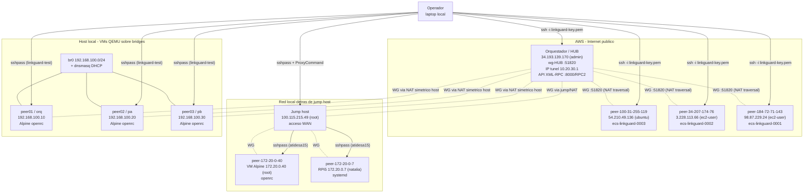
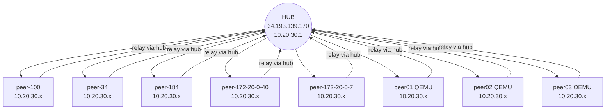
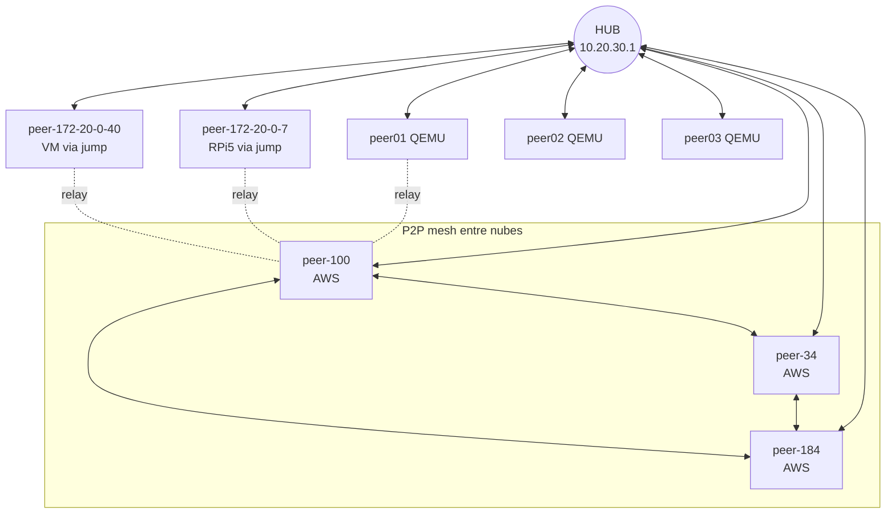
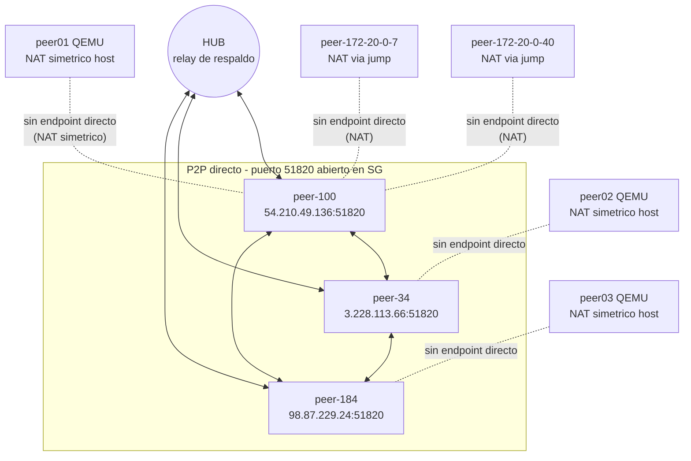
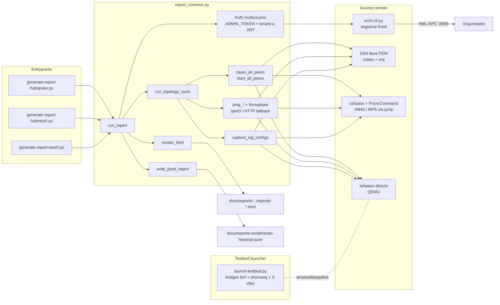

# Diagrama de arquitectura de todos los tests

Vista física y lógica del testbed de `tests-linkguard-aws`: orquestador/hub, 5 peers reales (3 AWS + VM40 + RPi5) y 3 VMs QEMU, con las tres topologías probadas (`hub-spoke`, `hub-mesh`, `mesh`) y el flujo de ejecución.

---

## 1. Infraestructura física del testbed



**Leyenda de acceso:**
- Líneas sólidas = SSH de control desde el operador.
- Líneas discontinuas = túneles WireGuard que se establecen durante el ciclo de pruebas.
- 3 canales SSH distintos: llave PEM (AWS/orq), `sshpass` + `ProxyCommand` via jump (VM40/RPi5), `sshpass` directo (QEMU).

---

## 2. Topologia hub-spoke

Todo el tráfico entre peers pasa por el hub. Sin P2P.



- Resultado esperado: 8 peers, todos reachables a traves del hub.
- Estado actual (AGENTS.md): completado, 8 peers OK.

---

## 3. Topologia hub-mesh

Peers de nube (AWS) con P2P directo entre ellos; el resto relay via hub.



- Nube-a-nube: P2P directo (TTL=64, menor RTT).
- NAT peers (VM40/RPi5/QEMU): relay via hub (TTL=63).
- Estado actual (AGENTS.md): completado en fast mode; terminales 1-3/7 pings (NAT esperado).

---

## 4. Topologia mesh

P2P directo entre todos los peers con endpoint publico. Sin relay central (excepto peers tras NAT).



- EC2-to-EC2: 6-7/7 OK (P2P real con `WG_LISTEN_PORT=51820`).
- NAT peers (jump/QEMU): 3/7 OK — sin endpoint publico, no hay conectividad directa.
- Estado actual (AGENTS.md): completado en fast mode; issue conocido documentado.

---

## 5. Componentes de codigo



---

## 6. Flujo del ciclo por topologia

```mermaid
flowchart TD
    S[Entry: hub-spoke | hub-mesh | mesh] --> A[get_admin_token desde orq]
    A --> B[ensure_tenant_user: crear tenant-a + login JWT]
    B --> C[Leer topologia original]
    C --> D[set_topology objetivo en orq]
    D --> E[F1 clean_all_peers<br/>peers + orq + hub wg-HUB]
    E --> F[F2 set_topology]
    F --> G[F3 start_all_peers<br/>update peer.env + restart service]
    G --> H[F4 wait_for_all_peers<br/>8/8 registrados]
    H --> I[F5 wait_for_handshakes<br/>wg show wg-HUB]
    I --> J[F5b capture_wg_configs<br/>wg show + showconf por peer]
    J --> K[F6 matriz de pings NxN<br/>8x7 = 56 pares]
    K --> L[F7 throughput nube<br/>iperf3 o HTTP fallback]
    L --> M[F9 check_wan_access<br/>VM40 + RPi5]
    M --> N[Restaurar topologia original]
    N --> O[render_html]
    O --> P[write_jsonl_report]
    P --> Q[Fin OK]
```

- `--fast`: pings de 2 paquetes, timeout 60s (iteracion rapida).
- Sin `--fast`: 5 paquetes, timeout 120s (medicion realista).

---

## 7. Inventario consolidado

| Peer ID | Host | Tipo | Acceso | NAT | Service mgr |
|---|---|---|---|---|---|
| peer-100-31-255-119 | 54.210.49.136 | AWS Ubuntu | llave PEM | ninguno | systemd |
| peer-34-207-174-76 | 3.228.113.66 | AWS Amazon Linux | llave PEM | ninguno | systemd |
| peer-184-72-71-143 | 98.87.229.24 | AWS Amazon Linux | llave PEM | ninguno | systemd |
| peer-172-20-0-40 | 172.20.0.40 | VM Alpine | sshpass via jump 100.115.215.49 | jump host | openrc |
| peer-172-20-0-7 | 172.20.0.7 | RPi5 | sshpass via jump 100.115.215.49 | jump host | systemd |
| peer01 (orq) | 192.168.100.10 | QEMU Alpine | sshpass directo (br0) | simetrico host | openrc |
| peer02 (pa) | 192.168.100.20 | QEMU Alpine | sshpass directo (br0) | simetrico host | openrc |
| peer03 (pb) | 192.168.100.30 | QEMU Alpine | sshpass directo (br0) | simetrico host | openrc |

**Total:** 5 reales + 3 QEMU = 8 peers bajo tenant-a. Orquestador/hub en `34.193.139.170`.

---

## Lectura rapida

- **3 entrypoints** (`generate-report-{hubspoke,hubmesh,mesh}.py`) solo cambian la topologia objetivo; toda la logica vive en `report_common.py`.
- **3 canales SSH** distintos por tipo de peer: PEM (AWS/orq), `sshpass + ProxyCommand` (VM40/RPi5 via jump), `sshpass` directo (QEMU).
- **3 topologias**: hub-spoke (todo relay), hub-mesh (P2P solo entre nubes), mesh (P2P entre endpoints publicos; NAT peers sin directo).
- **8 peers** bajo tenant `tenant-a`, orquestador/hub unico en `34.193.139.170:51820`.
- Salidas: HTML por corrida en `docs/reports/linkguard-aws/<topo>/<fecha>/` + historial JSONL en `docs/reporte-rendimiento-historial.jsonl`.
