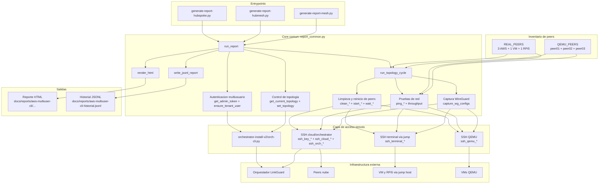

## Diagrama de componentes: `tests-aws-multiuser-cli`

### Lectura rapida

- Los tres scripts de entrada solo cambian la topologia objetivo: `hub-spoke`, `hub-mesh` o `mesh`.
- `report_common.py` concentra casi toda la logica del sistema.
- La autenticacion multiusuario pasa por `orch-cli.py`: obtiene `ADMIN_TOKEN`, crea/asegura `tenant-a`, emite token y hace `auth-login` para conseguir el JWT del tenant.
- La ejecucion principal hace un ciclo por topologia: limpiar, configurar, arrancar peers, esperar registro/handshake, medir conectividad y generar reporte.
- Hay tres canales de acceso remoto distintos porque el testbed mezcla AWS, terminales detras de jump host y VMs QEMU.
- Las salidas finales son un HTML por corrida y un JSONL historico con resumenes.
