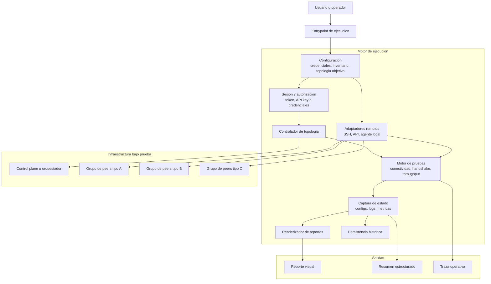

## Diagrama general: sistema de pruebas de topologias y reportes

### Lectura rapida

- Este diagrama abstrae el caso concreto y sirve para cualquier sistema que configure una topologia, ejecute pruebas distribuidas y genere reportes.
- Separa el problema en capas: entrada, ejecucion, infraestructura bajo prueba y salidas.
- El bloque `Adaptadores remotos` representa cualquier mecanismo de acceso a los nodos: SSH, agentes, RPC o APIs.
- `Captura de estado` y `Persistencia historica` quedan separados del renderizado para que el sistema pueda producir varios formatos de salida.
