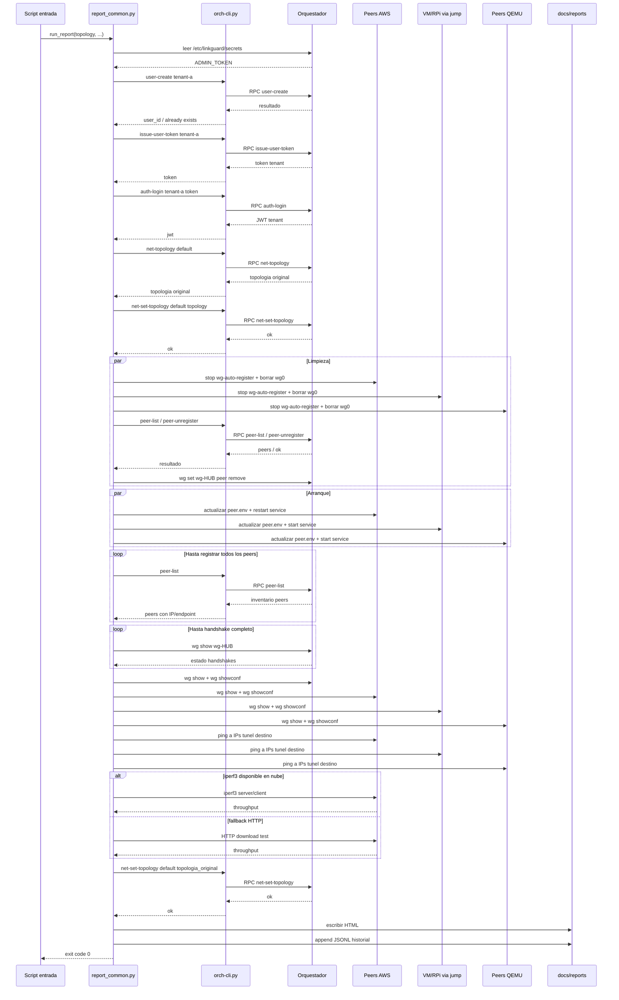

## Diagrama de secuencia: `tests-aws-multiuser-cli`

### Lectura rapida

- `report_common.py` actua como coordinador central de toda la corrida.
- `orch-cli.py` encapsula las llamadas RPC al orquestador para autenticacion, inventario y cambio de topologia.
- Las operaciones sobre peers se reparten en tres canales: AWS por llave SSH, terminales via jump host y QEMU por `sshpass`.
- El inventario devuelto por `peer-list` alimenta la matriz de pings porque aporta las IPs de tunel de cada peer.
- El reporte se genera al final, cuando ya se restauró la topologia original del orquestador.
